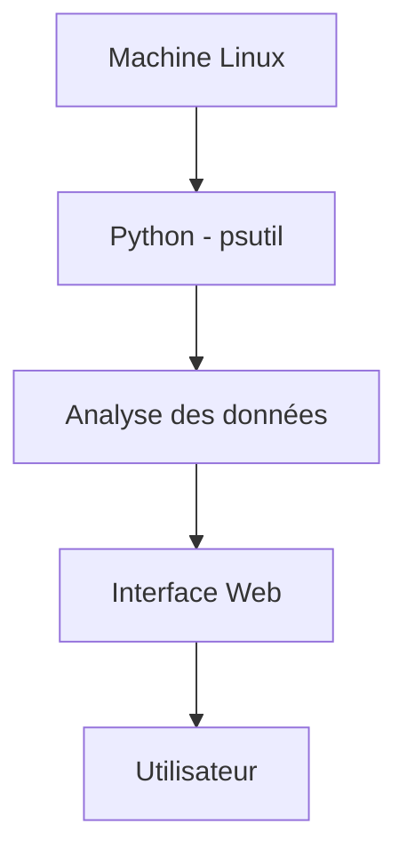

# AAA Monitoring Dashboard - Supervision & Analyse Système


Outil de supervision permettant de **collecter, analyser et visualiser en temps réel les performances d’un système Linux** via un script Python et une interface web.

---

## Résumé exécutif

Développement d’un dashboard de monitoring combinant **collecte de données système**, **analyse des ressources** et **visualisation temps réel**.

Le projet simule un outil de supervision utilisé en environnement professionnel (administration système, SOC, DevOps).

---

## Objectif du projet

* Surveiller l’état d’un système Linux
* Détecter des anomalies (CPU élevé, mémoire saturée)
* Visualiser les données de manière exploitable
* Comprendre le fonctionnement interne des ressources système

---

## Architecture



---

## Fonctionnement détaillé

1. Le script Python interroge le système via `psutil`
2. Les données sont traitées (CPU, RAM, disque)
3. Les résultats sont injectés dans le dashboard
4. L’interface affiche les métriques en temps réel

---

## Données collectées

* Utilisation CPU (%)
* Utilisation mémoire (RAM)
* Espace disque disponible
* Analyse des fichiers (type / taille)
* Charge globale du système

---

## Fonctionnalités

* Monitoring temps réel
* Dashboard visuel avec indicateurs
* Rafraîchissement automatique
* Analyse système simplifiée
* Interface lisible et exploitable

---

## Installation

### Prérequis

* Linux
* Python 3

### Installation

```bash
sudo apt update
sudo apt install python3-pip
pip install psutil
```

---

## Utilisation

Lancer le script :

```bash
python3 monitor.py
```

Ouvrir ensuite :

```bash
index.html
```

---

## Cas d’usage (réaliste)

Ce type d’outil peut être utilisé pour :

* supervision d’un serveur
* détection de surcharge système
* analyse rapide lors d’un incident
* monitoring en environnement SOC

---

## Compétences démontrées

* Administration système Linux
* Monitoring système
* Python (psutil)
* Analyse de données système
* Visualisation d’informations techniques
* Logique outil / dashboard

---

## Limites

* Pas de backend (API)
* Pas de stockage historique
* Pas d’alerting automatique
* Monitoring local uniquement

---

## Perspectives d’amélioration

* Ajout d’un backend (Flask / API)
* Historisation des données (logs)
* Mise en place d’alertes (CPU / RAM)
* Monitoring multi-machines
* Ajout d’authentification
* Intégration avec outils SIEM

---

## Valeur professionnelle

Projet proche des outils utilisés en entreprise :

* supervision système
* analyse des performances
* détection d’anomalies

Applicable aux métiers :

* Administrateur système
* DevOps
* Analyste SOC

---

## Structure du projet

```text
.
├── index.html
├── template.html
├── template.css
├── monitor.py
├── presentation.pdf
└── README.md
```

---

## Documentation

Le fichier `presentation.pdf` contient :

* les explications du projet
* les démonstrations
* les choix techniques

---

## Auteur

Alexis Noiret
Michaël Noiret
Étudiants en cybersécurité
